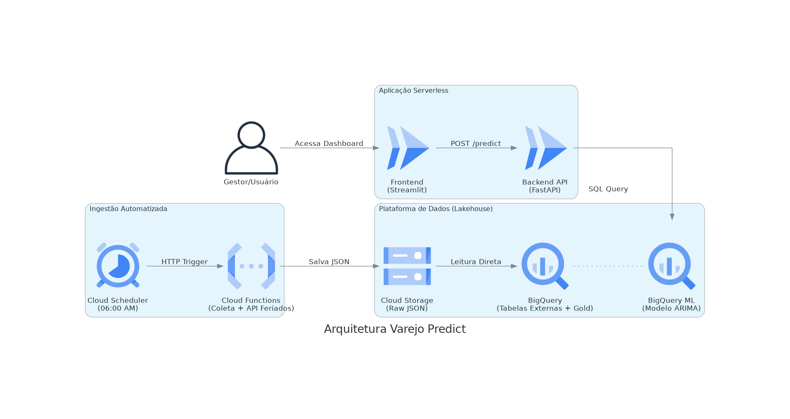

# 🛍️ Varejo PredictAI: Previsão de demanda com BigQuery ML

Este projeto implementa um pipeline completo de **Lakehouse** e **MLOps** no Google Cloud Platform (GCP) para prever a demanda diária de vendas no varejo. A solução utiliza dados históricos e enriquecimento com dados externos (feriados) para treinar modelos de série temporal (ARIMA_PLUS) dentro do BigQuery.

## 🏗️ Arquitetura da Solução

A solução segue o fluxo **Ingestão -> Processamento -> Machine Learning -> Aplicação**.

### Componentes:
1.  **Ingestão (Cloud Functions + Scheduler):** Script Python que roda diariamente (06:00 AM), consulta a API Brasil para verificar feriados e simula dados de vendas, salvando JSONs no Cloud Storage (Data Lake).
2.  **Armazenamento (Cloud Storage):** Camada Raw para armazenamento de arquivos brutos (JSONL).
3.  **Data Warehouse (BigQuery):**
    * **Tabelas Externas:** Mapeamento direto dos arquivos do Storage.
    * **Camada Gold:** Tratamento e engenharia de features via SQL.
    * **Machine Learning:** Modelo `ARIMA_PLUS` treinado via SQL (BigQuery ML) com ajuste automático de sazonalidade e feriados.
4.  **Backend (FastAPI + Cloud Run):** API REST que expõe o modelo de IA para consumo externo.
5.  **Frontend (Streamlit + Cloud Run):** Dashboard interativo para visualização das previsões e cenários (otimista/pessimista).

## 🛠️ Tecnologias Utilizadas

* **Cloud:** Google Cloud Platform (GCP)
* **Linguagem:** Python 3.10
* **Frameworks:** FastAPI, Streamlit, Pandas
* **Infraestrutura:** Cloud Run (Serverless), Cloud Functions, BigQuery, Cloud Storage
* **IA/ML:** BigQuery ML (Time Series Forecasting)

## 📂 Estrutura do Repositório

* `/ingestao`: Código da Cloud Function (ETL).
* `/backend`: API desenvolvida em FastAPI.
* `/frontend`: Dashboard desenvolvido em Streamlit.
* `/docs`: Diagramas e documentação da arquitetura.

---
*Projeto desenvolvido como requisito da disciplina de Arquitetura de Dados e IA.*
